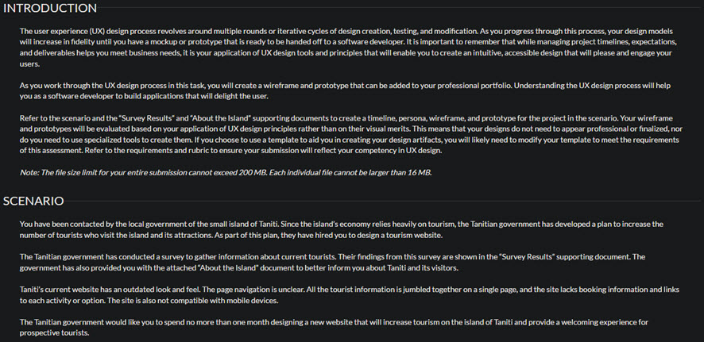

# Taniti Website

## Introduction
An interactive prototype for a Tanitian island website where users can learn about the island and book a trip to visit the island.

### The Assignment:
I originally coded this website as an assignment for D479 while attending WGU:

## Using Prototype
You may visit and test the prototype of the website by referring to the deployments in this repository.